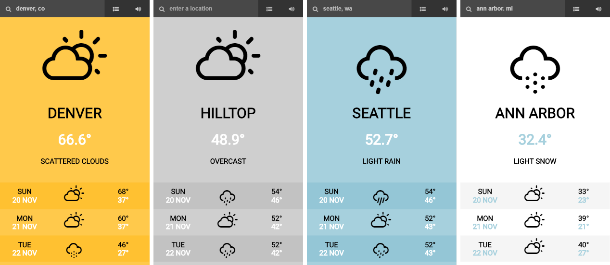
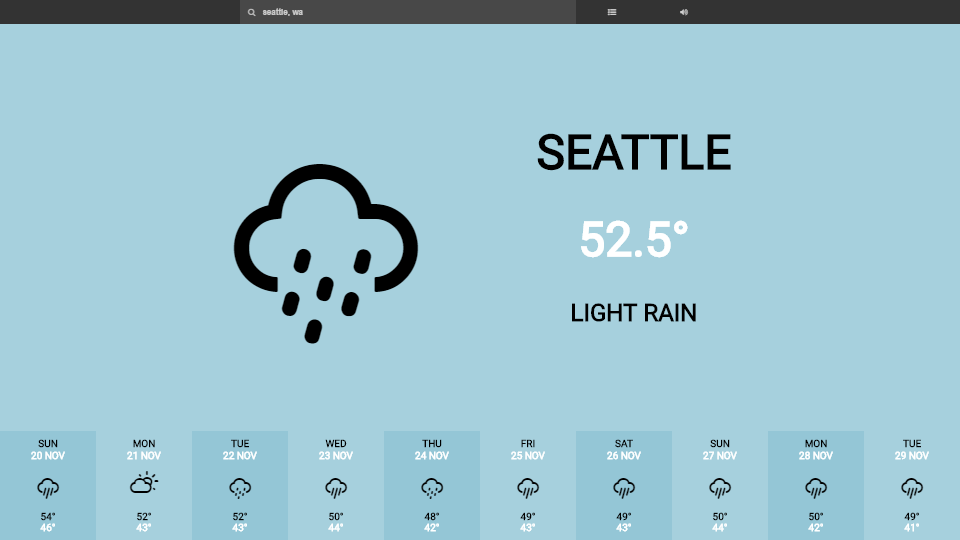
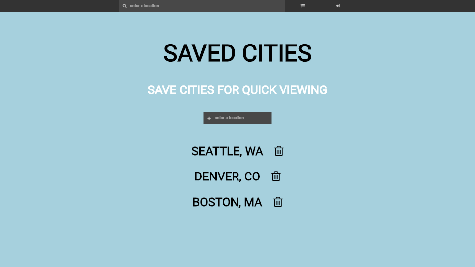

# Weather Mood

## Live Version
Live: https://tw3080.github.io/weather-mood/app/#/

## Summary
Weather Mood is a minimalist weather app with changing styles and white noise sounds based on the weather conditions of each city the user searches for. Designed to be unobtrusive and relaxing, Weather Mood displays only the most essential weather information in a concise way, without the typical "information overload" of other weather websites. Users can choose to allow the app to auto-detect their location and/or search for any city manually, and with the "saved cities" feature, users can store a list of cities for quicker access to those weather conditions.

## Style Previews

  

Because the weather conditions change based only on the weather of the current city, it can be difficult to view all of the styles when using the app without manually finding cities where it's sunny or raining, etc. Therefore, I wanted to include a preview of all styles to showcase the possibilities without having to depend on finding a city with the corresponding weather conditions. Unforunately, I can't really include the changes to the sound files here, but those are different for each style as well.

## Walkthrough

### Home

    

The home screen shows the current weather conditions and a 10-day forecast for a location. If the user chooses to allow geolocation services, the approximate location of the user is automatically used to populate the weather information on page load. Users can also search for specific locations and the weather information will update accordingly.

In the top-right corner of the navigation bar, users can go to their saved cities list or toggle the audio on/off.

### Saved Cities

    

The saved cities screen allows users to save locations for quick viewing. Locations are stored using local storage, and clicking the name of a city which has been added will redirect the user to the home page with weather information for that city. Users can add/delete cities from the list as they please.

## Technology Used
* HTML5
* LESS / CSS3
* JavaScript
* AngularJS
* Angular-route
* Angular-animate
* Angular-local-storage
* Webpack
* NPM
* [Weather Underground API](https://www.wunderground.com/weather/api/)
* [Weather Icons](https://erikflowers.github.io/weather-icons/)
* Normalize.css
* Font Awesome

## Future Plans
* It would be great to have a feature which allows users to more easily see/hear the different designs/sounds for each weather condition, but I'm unsure of how to implement this feature because there's no way to use the API to pick cities based on weather conditions.
* 'Weather Icons' have pretty inconsistent vertical padding/spacing between different icons, and this causes the vertical symmetry of the desktop styles to sometimes look off-center depending on the weather conditions (this is visible in the 'home' and 'saved cities' screenshots). I'd like to remedy this by individually adjusting the vertical padding for each icon, but since this process will be fairly tedious, I've put it on hold for now.
* The Weather Underground API (free version) is limited to 10 calls per minute, which isn't a lot, and it might be useful to find a different weather API with higher limits to make testing/demoing easier.
